<h1>Ontime</h1>
 
<h4>Introduction</h4>

Office parks with large number of people have problems with identifying people entering their premises. Since the pandemic people are wearing masks and partially remote working, managing who should be on premises is becoming difficult.
Ontime is an application that will help both the help desk and the office park companies to manage  who comes in the office park and at what time. All the office park employees will scan a unique QR code upon entering the office park, which will then prompt them to fill the covid 19 form.

<h4>About OnTime</h4>

The app has 3 users, which includes Admin which is desktop only version, Employee, and Help Desk which are both mobile    version only.

 <h5>Admin</h5>
 <ul>
    <li>Admin will be able  to login.</li>
    <li>Admin will be able to register new users to the system.</li>
    <li>Admin will be able to view scan logs of the employees scanned.</li>
    <li>Admin will be able to deactivate and activate a user's account.</li>
 </ul>

 <h5>Help Desk</h5>
 <ul>
    <li>Help desk will be able to login.</li>
    <li>After logging in the help desk will be given an interface that has a camera that will allow him/her to scan employees</li>
    <li>After scanning the employee the help desk will be able to see the scanned employee's information.</li>
 </ul>

  <h5>Employee</h5>
  <ul>
    <li>Employee will be able to login.</li>
    <li>Employee will be able to present the QR Code.</li>
    <li>The Covid form will pop-up after scanning.</li>
    <li>Employee will be able to update their profile.</li>
  </ul>

  <h4>Screenshots</h4>
  

   <h5>Admin flow</h5>
     
<strong>When the admin land on our application they first have to login as the admin to access the admin dashboard.</strong>

    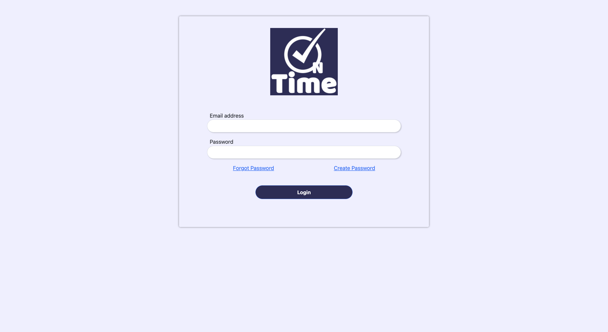
       
    
<strong>Admin analytics page that allows the admin to view analytics regarding the amount of employees, deactivated users, and of employees scanned for the day. Also allows admin to view the list of all users within the company system.

    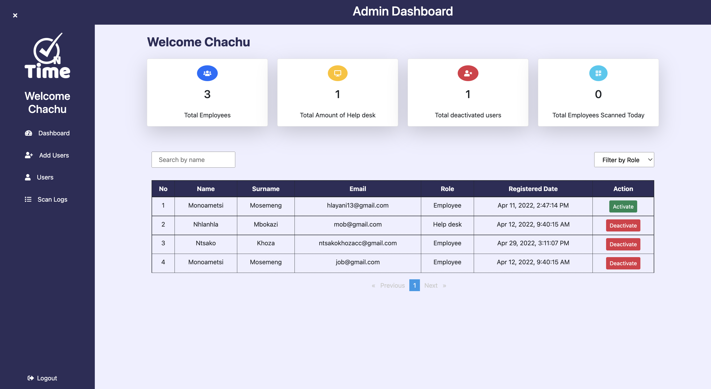</strong>
      
     
<strong>Admin will be able to register the user manually or by uploading the CSV file.</strong>

    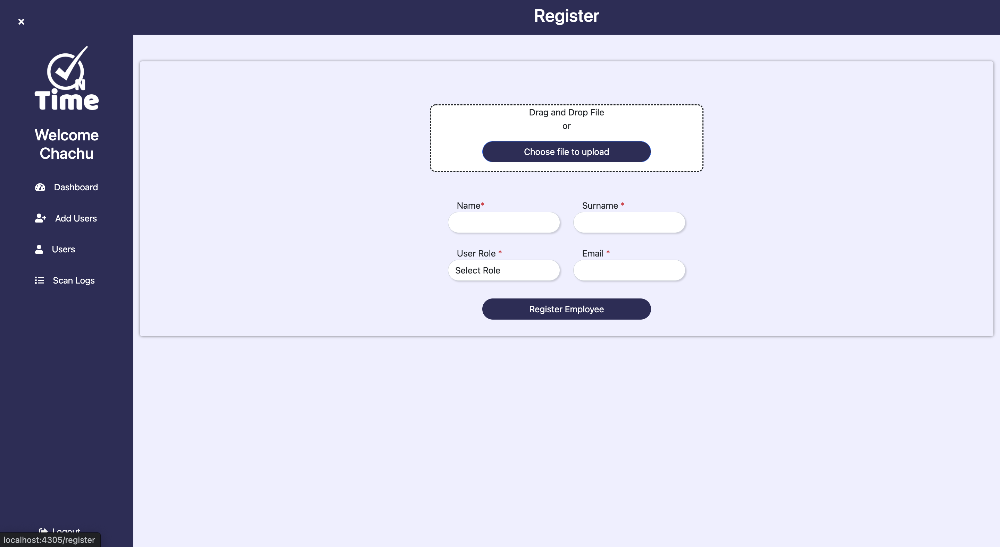
      
    
<strong>The employee list page displays the total number of employees, including each employee's information. It allows the admin to search for a specific employee and also allows the admin to filter through employees by their roles.</strong>

    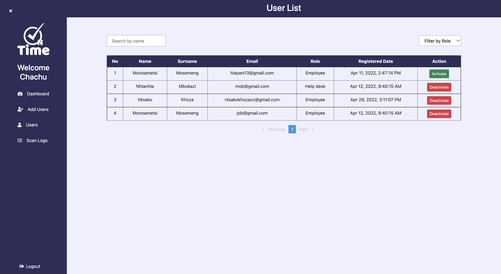
      
    
<strong>Scan logs page displays the days and times of when an employee was last scanned by the help desk. It allows an admin to filter through the scan logs by their dates through the date range picker.</strong>

    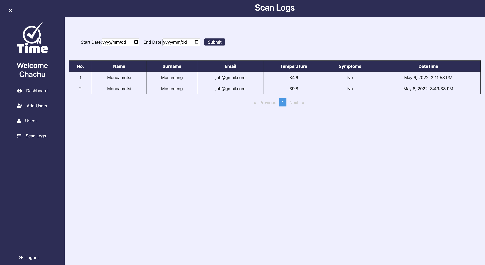
  
 

  

   <h5>Employee flow</h5>
    
<strong>When the user lands on our application they first have to login as an employee. The QR code is the page that generate a unique QR code for an employee, when ever they access the application. The QR code will hold a link to the employee profile which can only be accessed by the help desk.The employee can also update his/her profile.</strong>

    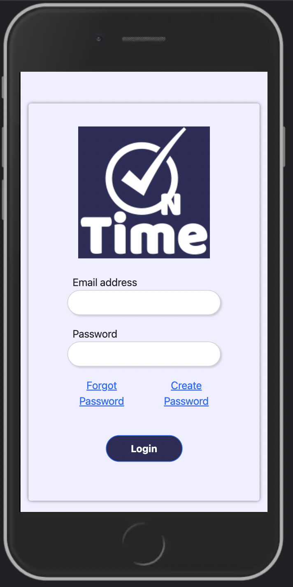
    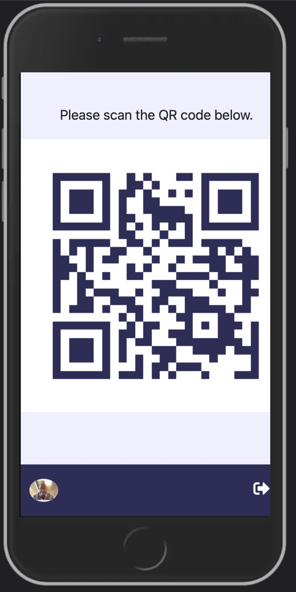
    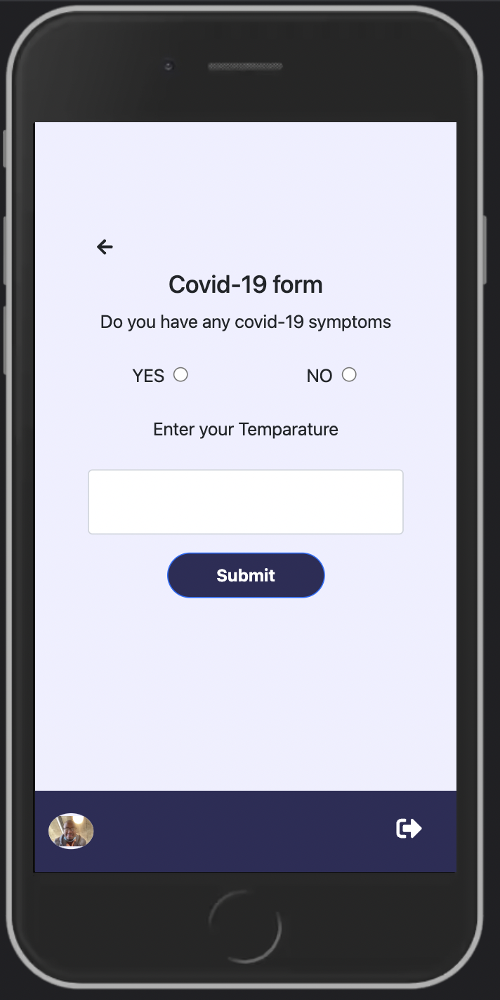
    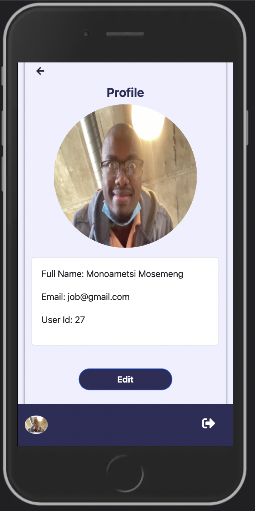
    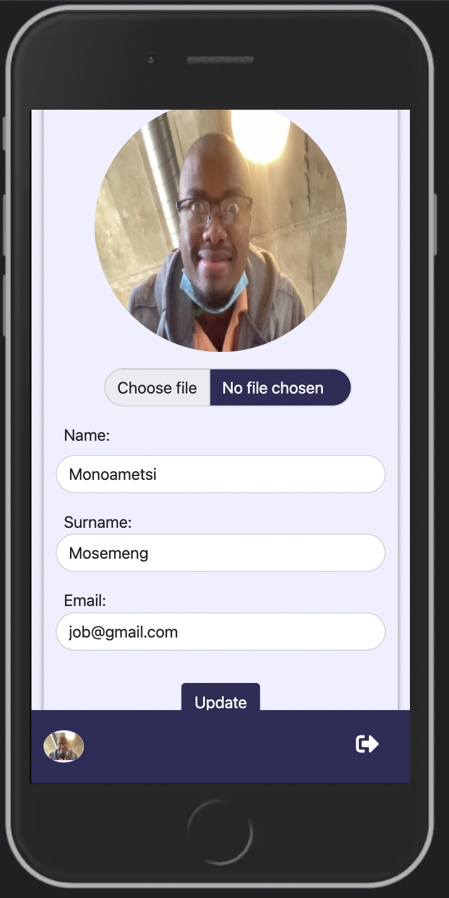
  
 

  

   <h5>Help_Desk flow</h5>
   
<strong>When the user lands on our application they first have to login as a help desk.  After logging in he/she will get access to a page that holds the camera scanner which he/she can use to scan the employees for identity verification. After scanning he/she gets routed to a profile page that displays the information of the user that has been scanned.</strong>

    
    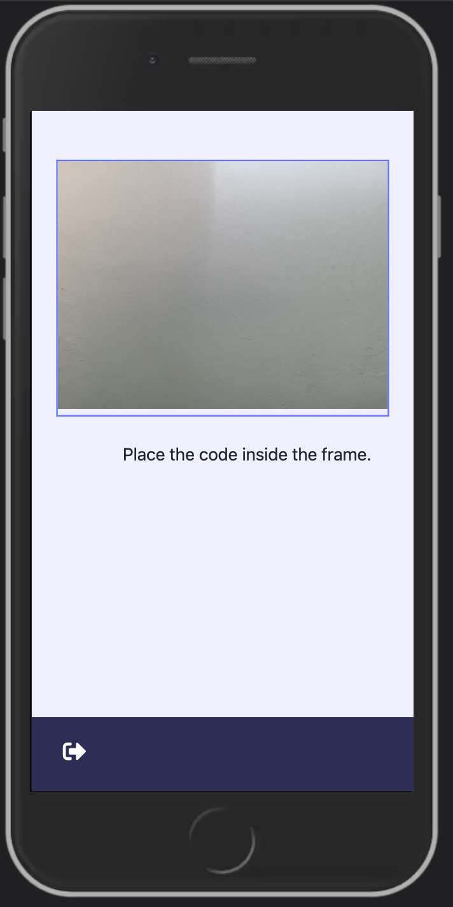
    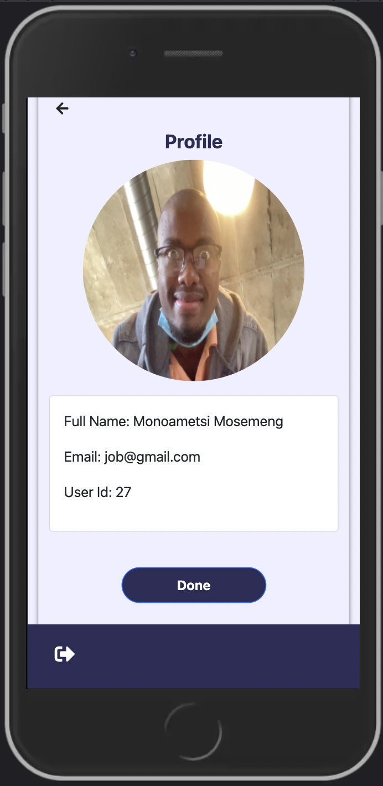
  

  
<h4>Prerequisites</h4>
<ul>
    <li>Git</li>
    <li>Download/install nodejs on (<a href="http://nodejs.org/">http://nodejs.org/</a>)</li>
    <li>An IDE of your choice (VScode, etc...)</li>
    
</ul>
    <h4>Cloning(Downloading application from gitlab to local machine)</h4>
<ul>
    <li>Open VScode </li> 
    <li>After opening VScode on the top menu click terminal and choose new terminal</li> 
    <li>The terminal will appear on the bottom of the VScode</li> 
    <li>Run<code>git clone https://gitlab.thedigitalacademy.co.za/Adelaide/group-c-ontime.git</code> to clone the app into your local machine</li>
</ul>
<h4>Running backend application locally</h4>
<ul>
    <li>To access the repo <code>cd group-c-ontime</code></li> 
    <li>To access the backend repo <code>cd Backend</code></li> 
    <li>Run <code>npm install</code> to install app dependencies</li> 
    <li>Run <code>npm start</code> to run Backend</li> 
    <li>Navigate to <a href="http://localhost:4306/api/onTime">http://localhost:4306/api/onTime</a></li>
</ul>

<h4>Running frontend application locally</h4>
<ul>
    <li>To access the repo <code>cd group-c-ontime</code></li> 
    <li>To access the frontend repo <code>cd Frontend</code></li> 
    <li>Run <code>npm install</code> to install app dependencies</li> 
    <li>Run <code>npm start</code> to run frontend</li> 
    <li>Navigate to <a href="http://localhost:4305">http://localhost:4305</a></li>
</ul>

<h4>Licence</h4>

onTime Team @The Digital Academy

